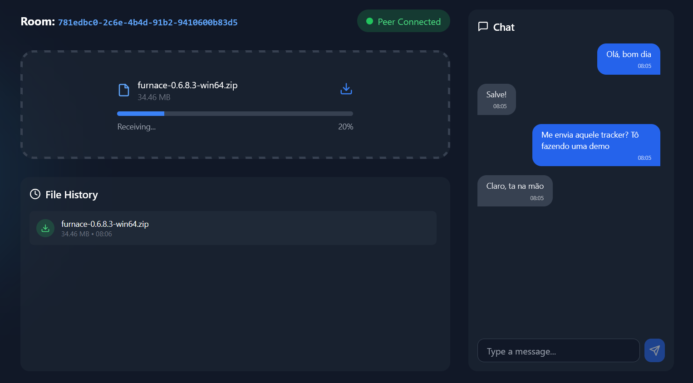

# 👻 GhostShare

> **Compartilhe arquivos como um fantasma.** Sem servidores, sem rastros, apenas você e seu par.

GhostShare é uma aplicação de compartilhamento de arquivos P2P segura e sem servidor, projetada para privacidade e velocidade. Ele usa WebRTC para estabelecer uma conexão direta entre os pares, garantindo que seus arquivos **nunca** toquem em um servidor. O servidor atua apenas como um mecanismo de sinalização para apresentar os pares um ao outro.

## 🚀 Demo ao Vivo

Experimente agora: **[ghostshare-p2p.vercel.app](https://ghostshare-p2p.vercel.app)**

[📸 Screenshots](#-screenshots)

## ✨ Funcionalidades

- **🔒 Privacidade em Primeiro Lugar**: Arquivos são transferidos diretamente entre navegadores. Sem bancos de dados, sem buckets S3, sem logs.
- **⚡ Extremamente Rápido**: Conexão P2P significa sem gargalos de servidor. A velocidade de transferência é limitada apenas pela sua rede.
- **📦 Sem Limites de Tamanho**: O GhostShare usa uma abordagem híbrida inteligente. Arquivos pequenos (<1GB) são processados na memória para velocidade máxima, enquanto arquivos gigantes usam **StreamSaver.js** para transmitir diretamente para o disco, contornando limites de memória. Compartilhe arquivos de 10GB+ sem travar seu navegador.
- **💬 Chat em Tempo Real**: Chat seguro e efêmero entre os pares.
- **📜 Histórico de Arquivos**: Acompanhe o que você enviou e recebeu durante a sessão.
- **🌐 Conectividade Robusta**: Usa múltiplos servidores STUN públicos (Google, Twilio, Mozilla) para garantir conexões P2P mesmo através de firewalls restritivos.
- **🎨 Interface Moderna**: Design responsivo com Tailwind CSS e efeitos visuais interativos.

## 🛠️ Tech Stack

- **Frontend**: React + Vite + Tailwind CSS
- **Backend**: Node.js + Express + Socket.io (Sinalização)
- **P2P Core**: Simple-peer (WebRTC)
- **Streaming**: StreamSaver.js

## 🏃‍♂️ Como Rodar

### Pré-requisitos

- Node.js (v18+)

### Início Rápido

1. **Clone e Instale**

   ```bash

   git clone https://github.com/jordaoaq/ghostshare.git
   cd ghostshare
   npm run install:all
   ```

2. **Build**

   ```bash

   npm run build
   ```

3. **Iniciar**

   ```bash

   npm start
   ```

   Abra [http://localhost:3000](http://localhost:3000) no seu navegador.

### Modo de Desenvolvimento

Rode o frontend e o backend simultaneamente com hot-reload:

```bash
npm run dev
```

## 📖 Como Usar

1. Clique em **"Create Room"** na página inicial.
2. Compartilhe a **URL da Sala** gerada com um amigo.
3. Aguarde o indicador **"Peer Connected"** ficar verde.
4. **Arraste e Solte** qualquer arquivo para começar a compartilhar!
5. Use o chat para se comunicar com segurança.

Feito por [jordaoaq](https://github.com/jordaoaq)

## 📸 Screenshots


